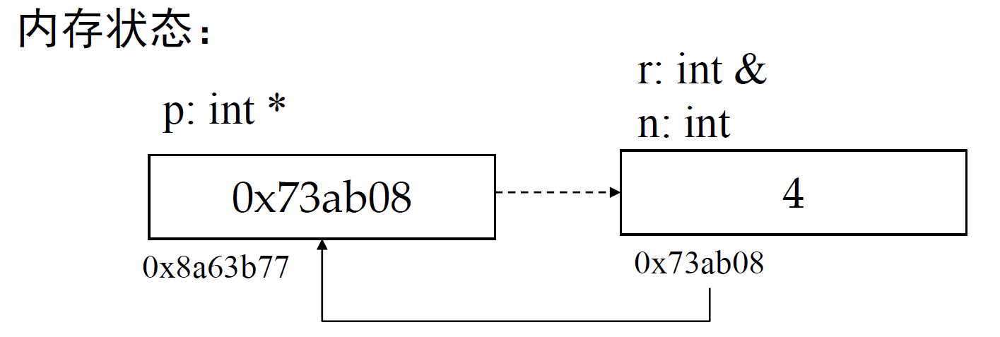

# 从C到cpp 数据抽象与类型系统
### 前言
软件设计实践这门课讲述的是如何由写程序转为写软件，而一个好的软件我们希望是可维护的，可扩展的，有鲁棒性/健壮性的，可复用的以及可理解的。  
而达成这些条件的关键就是**抽象**。整门软件设计实践，在讲述的就是达成这样的一个抽象的故事。  
#### 语言处理程序 
程序设计语言分类：
- 机器语言：由二进制机器指令构成 可直接执行  
- 汇编语言：为方便记忆 将机器语言用助记符和符号写成的程序  
- 高级语言：易于理解的方式 按严格的语法规则和一定的逻辑关系写出的程序集合  

将源程序翻译成目标程序有两种方式：编译以及汇编  
编译-cpp 解释- python  
C++的翻译过程：.cpp -预处理-> .i - 编译 ->.s - 汇编 -> .obj - 链接 -> .exe  
##### 内存（理解指针的关键）——数据抽象  
内存地址：每个内存对应一个内存地址。由0开始计数  
机器语言/汇编语言：由内存地址访问内存中的数据  
高级语言：给内存位置起一个名字 通过名字访问数据  
抽象：对一组元素进行命名从而可通过名字对这组元素作为一个整体进行操纵的机制  
### 数据类型
定义：一组性质相同的值的集合以及定义在这个值集合上的一组操作  
C++是静态类型语言，即在编译时可确定所有变量和表达式的类型  
类型标识 eg.`int double char[10] int *`  
类型别名：`using 别名=类型标识`  
```
using IntPointer=int *  
IntPointer p = &b  
```  
优点：  
&emsp; 提前避免错误  
&emsp; 编译器可针对类型信息进行优化  
缺点：增加工作量  
`Rk:增加工作量有时指的是记忆层面上的工作量 对于一些很长很长的类型标识用一个别名是非常好的方式去简化`
`将std::unique_ptr<Value> 记为 ValuePtr等`
#### 变量在声明时发生了什么
- 找到能承载变量长度的内存空间  
- 将变量名绑定到这块内存空间  
- 对这块内存空间的内容初始化（若没有指定初始化 则依赖空间自身行为进行初始化）  
  
#### cpp有多种初始化方法 
```
T a1 {}     int a[3] {1,2,3}
T a2 = {}   int a[3] = {1,2,3}
T a3 ()     int n (5)
T a4 =      int n = 5
```
c++11的统一初始化：第一种方式 即所有数据类型均可通过第一种方式来初始化  
优点：防止窄缩 （窄缩：数据转化后再向内转化而不能得到原有表示的情况，例如float转化为int）  
若统一初始化 编译期间会强制检查 若发生窄缩则编译失败  
```
char c1 = 11111  //警告
char c2 {11111}  //错误   原因：char占8位  对于signed char是从-127到128  unsigned char 是从0到255
char c {100} //允许
```
初始化：仅开空间绑定变量时的行为  
### 引用
定义：某个变量的引用等价于这个变量，相当于该变量的**别名**(指向地址)  
```
int n=4;
int &r=n;
r=3;
r=? 答案：3
n=? 答案：3
```
注意事项：  
- 定义引用时必须初始化为引用某个变量  
- 引用后便只指向该位置   
- `*`取地址 `&`解地址  

#### 引用与指针
```
int n = 4;
int& r = n;
int* p = &n;
```

为什么已经有指针类型却还要提供指针类型？
在c中 函数的传递均为值传递 因此写一个swap函数需要调用指针
在C++中 引用类型可以提供引用传递 因此写swap函数可以使用引用
`Rk：这里就不提供swap函数的内容了 非常经典且容易搜到`
#### 引用作为函数的返回值
函数的返回值可以是引用
```
int n = 14;
int& SetValue(){
    return n;
}
int main(){
    SetValue = 40;
    std::cout<< n <<std::endl;  //输出结果：40
}
```
### auto 类型推导
用于定义变量 编译器可以自动判断类型  
使用auto定义必须马上初始化  
auto不能定义数组  
### 常量与const关键字
##### 常量：编译期间就能确定的值 不会发生变化  
- 字面量 eg `3 42 'a' "aaaa"`   
- 完全由自勉联那个组成的式子 e.g. `1+1`
- 其它

##### 只读变量 用`const`修饰 该变量值 不能改变 初始化时不能省略初始化器  
只有使用常量作为初始化值的只读变量才是常量  
`constexpr`声明的变量一定是常量  
#### const与引用('&'(读作花))
定义引用时 前面加`const`关键字 即“只读引用”  
不能通过只读引用去修改其引用的内容（其引用内容本身可以修改） 
```
int n = 100;
const int& a = n;
a = 200 //错误
n = 300 //正确
```
`const T&` 与`T&` 不同  
`T&` 可以用来绑定到`const &`，反之不可  
- T & 类型的引用、 T 类型的变量和常量、 const T 类型的只读变量，都可以用来初始化 const T & 类型的引用
- T 类型的常量、 const T 类型的只读变量、 const T & 类型的引用则不能用来初始化 T & 类型的引用，除非进行强制类型转换
#### const与指针('*'(读作星))
在类型前加const即`const T*` 可理解为指向只读变量的指针  
即不可通过该指针去修改其指向的内容，但指针指向可以变化  
在类型后加const，即`T* const`  
指针指向不可变化 但可通过指针去修改其指向内容  
不可以把`const T*`赋给`T*` 但反过来可以  
只读指针与只读引用的作用：可避免汗水不不小心修改可变参数指针/引用指向的内容  
### 动态内存分配  
动态分配变量  
```
T* p=new T  
delete p  
```
动态分配数组(可以用变量名来开长度)  
```
T* p=new T []  
delete [] p  
```
用new开辟的空间一定要用delete释放  否则即使程序运行结束这部分内存也不会被操作系统回收 从而造成"内存泄露"